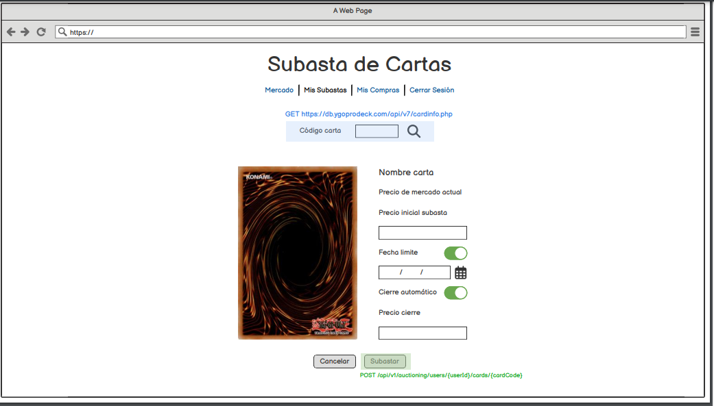

# Historia: Publicacion de Item.

- Yo como: Usuario vendedor
- Quiero: Poder registrar un Item subiendo fotos y estableciendo precio. Ademas de la modalidad precio fijo o subasta. . Ademas de disponibilidad Geográfica.
. Para: Poder vender mis tarjetas.

## Pendientes de definición.

1. ¿El numero de imagenes no deber ser ilimatado?
R. Juan Perez indica que en su experiencia 4 son suficientes


## Especificación de requerimientos.

1. La cantidad maxima de fotos es de 4.
2. Al momento de subir la imagen, se debe indicar al vendedor, que la resolución debe ser de 30 ppi. El tamanio maximo de una imagen 1024 x 2567, aspect ratio de 16:9. Archivos JPG.
3. Las imagenes deben subirse de acuerdo al punto 2. Una vez que los reciba el servidor se debe procesar la imagen para verificar si cumple las condigiones y se debe generar una imagen mas pequenia de menos de 200KB y un tamanio de 256 x 438.
4. Se deben enviar las imagenes a proceso de verificacion de contenido apropiado.

## Analisis

### Pantalla de creacion de nueva subasta

A continuación se presenta la pantalla de subida, cuyo funcionamiento es.

1. El usuario hizo clic previamente en Crear Nueva Subasta.
2. El usuario deberá tener lista las images...



### Pantalla de subida de imagen

## Criterios de aceptacion

Gherkin

### Validacion de cantidad de imagenes

- Dado: Que el usuario inico sesión y desea crear una nueva subasta.
- Cuando: Este por guardar la subasta
- Entonces: El sistema debe validar que subio al menos 2 y máximo 4.

### Código de tarjeta no encontrado

## Disenio

### Pantalla de creacion de nueva subasta

1. Para buscar el coddigo de la carta:

Request:
```
GET BASE_URL/api/v1/cardInfo/{cardCode}
Accept: Application/json
Authorization: Bearer JWT
```

Response: Exitoso statusCode: 200
```
{


}
```

Response: No encontrado statusCode: 404
```

```


